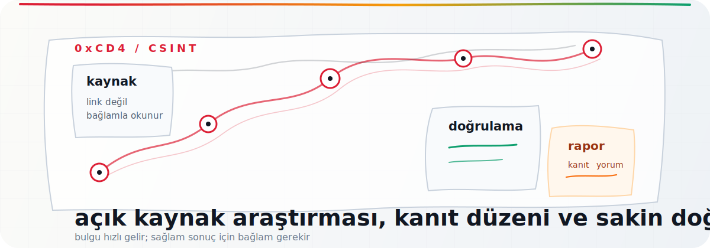

<div align="center">
  
</div>

# 0xCD4

**TR**  
Açık kaynak araştırması, doğrulama ve güvenli çalışma düzeni üzerine notlar tutuyorum.

CSINT tarafında amacım uzun araç listeleri yapmak değil; bir bulgunun nereden geldiğini, hangi bağlamda okunacağını ve rapora nasıl temiz taşınacağını daha anlaşılır hale getirmek.

**EN**  
I keep notes on open-source research, verification, and safer research workflows.

With CSINT, I am not trying to build another long list of tools. I care more about where a finding comes from, how it should be read in context, and how it can be carried into a report without losing clarity.

## Üzerinde çalıştığım şeyler / What I work on

| Alan / Area | Kısa not / Short note |
| --- | --- |
| CSINT Kaynak Arşivi / CSINT Resource Archive | OSINT kaynaklarını kategori, risk ve doğrulama notuyla düzenliyorum.<br>I organize OSINT resources with category, risk, and verification notes. |
| Handbooklar / Handbooks | Türkçe başvuru dokümanları ve tekrar dönülecek çalışma notları.<br>Reference documents and field notes worth coming back to. |
| İş akışları / Workflows | Domain, görsel, sosyal medya, kriz ve raporlama için adım adım rotalar.<br>Step-by-step paths for domains, images, social media, crisis checks, and reporting. |
| Sorgu disiplini / Inquiry discipline | Kanıtı, yorumu ve varsayımı birbirinden ayırmaya odaklanıyorum.<br>I try to keep evidence, interpretation, and assumptions separate. |

## Bağlantılar / Links

- Kaynak arşivi / Resource archive: [0xcd4.github.io](https://0xcd4.github.io/)
- Handbooklar / Handbooks: [0xcd4.github.io/handbooks](https://0xcd4.github.io/handbooks)
- İş akışları / Workflows: [0xcd4.github.io/workflows](https://0xcd4.github.io/workflows)

## Çalışma tarzım / How I work

Araştırmaya önce soruyla başlarım. Kaynak sonra gelir.

I start with the question first. The source comes after that.

Tek bir linki sonuç gibi yazmam. Tarih, bağlam, ikinci kaynak ve mümkünse orijinal kayıt olmadan notu kapatmam.

I do not treat one link as a conclusion. I look for date, context, a second source, and the original record when it is available.

Kişisel veri, konum bilgisi ve hassas detaylarda ölçülü davranırım. Bulmak ayrı şey, paylaşmak ayrı şey.

I try to be careful with personal data, location details, and sensitive information. Finding something and publishing it are not the same thing.

## İlgilendiğim başlıklar / Topics

```text
OSINT       kaynak keşfi, arşivleme, doğrulama
            source discovery, archiving, verification

GEOINT      görsel ipuçları, harita, zaman ve yer bağlamı
            visual clues, maps, time and place context

SOCMINT     açık profil izi, iddia kontrolü, platform bağlamı
            public profile traces, claim checks, platform context

OPSEC       güvenli çalışma alışkanlığı, iz azaltma
            safer research habits, reducing unnecessary exposure

Raporlama   kanıt kaydı, sınırlılık, güven düzeyi
Reporting   evidence logs, limits, confidence level
```

<div align="center">

```text
Bulmak kolay olabilir. Doğru bağlama oturtmak asıl iştir.
Finding something can be easy. Putting it in the right context is the real work.
```

</div>
