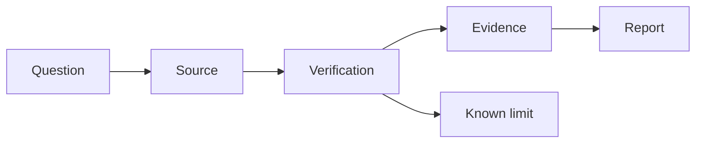

# Ahmet Göker

I work on OSINT, threat intelligence, AI workflow security, and defensive research.

[CSINT Research](https://csintresearch.org/) is my public research workspace. I build practical tools, document how findings were verified, and publish the limits of the available evidence.

> Start with the question. Keep the source. Stop where the evidence stops.

## How the work moves

```mermaid
flowchart LR
    Q["Question"] --> S["Source"]
    S --> V["Verification"]
    V --> E["Evidence"]
    E --> R["Report"]
    V --> L["Known limit"]
```

Every report should make this path visible. A lead is not a finding. A finding without its source and limits is not ready to publish.

## Vision

Make open-source research easier to inspect, reproduce, and challenge.

## Mission

Build useful tools and hands-on labs for researchers and defenders. Keep facts, inference, and assumptions separate. Preserve context. Record what could not be verified.

## Current work

### [n8n AI Security Regression Gate](https://github.com/0xCD4/n8n-ai-agent-security-lab)

Static and staging-safe security checks for n8n AI workflows, with reviewable JSON, Markdown, JUnit, and SARIF reports.

### [GOSI-ready OSINT VM](https://github.com/0xCD4/gosi-ready-osint-vm)

A repeatable Ubuntu workstation for lawful OSINT practice and hands-on study.

### [Operation Glass Harbor](https://github.com/0xCD4/operation-glass-harbor)

A fictional defensive investigation lab covering OSINT, HUMINT, threat intelligence, and incident response.

## Links

- [CSINT Research](https://csintresearch.org/)
- [X](https://x.com/_shadowintel_)
- [LinkedIn](https://www.linkedin.com/in/ahmet-göker)

Older reverse engineering and low-level security work remains available in the repositories tab.
