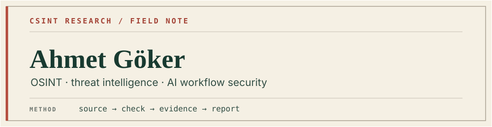

  

  <a href="https://en.csintresearch.org/">CSINT Research</a> ·
  <a href="https://en.csintresearch.org/research">Research notes</a> ·
  <a href="https://www.linkedin.com/in/ahmet-g%C3%B6ker">LinkedIn</a> ·
  <a href="https://x.com/_shadowintel_">X</a>

I build defensive tools and practical research environments. My work moves between open-source intelligence, threat intelligence, low-level security, and safer AI automation.

I try to show the evidence, the method, and the limits of what I could verify.

## Current work

- **[n8n AI Agent Security Lab](https://github.com/0xCD4/n8n-ai-agent-security-lab)** — local-first static review, trust-boundary mapping, regression checks, and a narrow Docker-based release rehearsal for supported n8n workflow changes.

- **[CSINT Research](https://en.csintresearch.org/)** — an independent workspace for sourced OSINT notes, threat-intelligence tools, defensive labs, and reproducible investigation methods.

- **[TraceFlow thesis](https://github.com/0xCD4/traceflow-thesis)** — undergraduate research on Linux runtime behavior analysis with DynamoRIO.

## Selected labs

- **[GOSI-ready OSINT VM](https://github.com/0xCD4/gosi-ready-osint-vm)** — a repeatable Ubuntu workstation for lawful OSINT practice.
- **[Operation Glass Harbor](https://github.com/0xCD4/operation-glass-harbor)** — a fictional, multi-stage defensive investigation campaign.
- **[N4TIVE](https://github.com/0xCD4/N4TIVE)** — Android native reversing challenges covering memory corruption, anti-debugging, and custom VM analysis.
- **[Linux Kernel Exploitation CTF Lab](https://github.com/0xCD4/kernel-ctf-lab)** — a focused environment for learning kernel exploitation safely.

## Working principles

`source before summary` · `evidence before confidence` · `unknowns stay visible`

Older reverse-engineering and security experiments remain available in the repositories tab.
