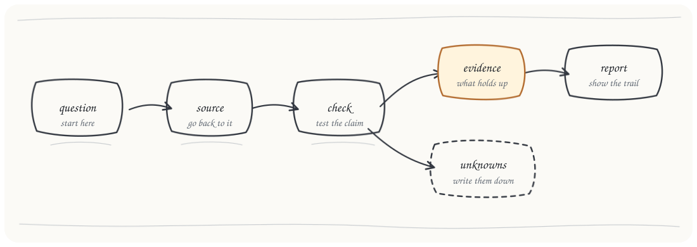

# Ahmet Göker

I work on OSINT, threat intelligence, AI workflow security, and defensive research.

Most of my public work is at [CSINT Research](https://csintresearch.org/). I build tools and labs, explain how I checked a finding, and note what I could not verify.

## How I work

I start with a question, go back to the source, and check the claim. If the evidence holds up, I show how I got there. If something is missing, I say so.

## Projects

### [n8n AI Security Regression Gate](https://github.com/0xCD4/n8n-ai-agent-security-lab)

Checks n8n AI workflows for common security regressions and writes the results as JSON, Markdown, JUnit, and SARIF.

### [GOSI-ready OSINT VM](https://github.com/0xCD4/gosi-ready-osint-vm)

A repeatable Ubuntu workstation for OSINT practice and study.

### [Operation Glass Harbor](https://github.com/0xCD4/operation-glass-harbor)

A fictional investigation lab for practicing OSINT, HUMINT, threat intelligence, and incident response.

## Links

- [CSINT Research](https://csintresearch.org/)
- [X](https://x.com/_shadowintel_)
- [LinkedIn](https://www.linkedin.com/in/ahmet-göker)

Older reverse engineering and low-level security work remains available in the repositories tab.
